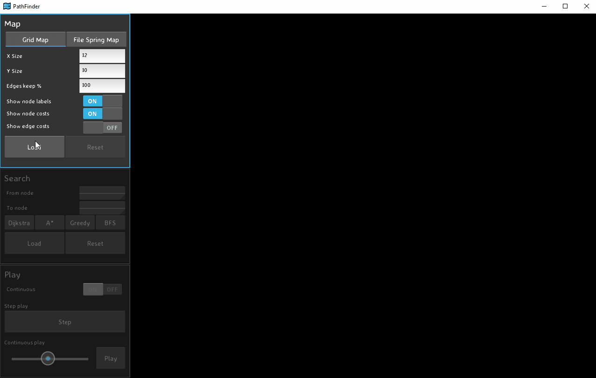

# Path Finder

Path Finder is a visualization tool to demonstrate how different search algorithms work. I've created it while studying course _Intro to Artificial Intelligence_ (https://classroom.udacity.com/courses/cs271). UI is built on Kivy framework (https://kivy.org/#home).

## Installation

Install in two steps. Clone the repository and run provided script:
```
git clone https://github.com/tekian/path-finder.git
cd path-finder
.\pathfinder.bat  (Windows)
./pathfinder.sh   (Linux)
```

Provided scripts execute following steps:
- Checks you have Python 3 installed (searches in `PATH`)
- Installs required dependencies (from [requirements.txt](./requirements.txt))
- Starts the application (by running [src/pathfinder.py](./src/pathfinder.py))

(Nothing else. No need to be paranoid. Read sources [here](./pathfinder.bat) and [here](./pathfinder.sh).)

## Running

Run `pathfinder.sh` or `pathfinder.bat` depending on your platform. See [Installation](#installation).



## Features

Application supports two modes of map generation:
- **Grid Map** – You can provide `X`, `Y` and optionally how much `% Edges to keep` (edge cost equals 1)
- **File Spring Map** – Red from file ([example](./src/romania.json)) & positions generated by [Fruchterman-Reingold algorithm](https://networkx.github.io/documentation/networkx-1.9/reference/generated/networkx.drawing.layout.spring_layout.html) (Spring)

It supports following search algorithms:
- [A* Search Algorithm](https://en.wikipedia.org/wiki/A*_search_algorithm) – Implementation at [a_star_finder.py](./src/pathfinding/algorithms/a_star_finder.py)
- [Greedy First Search](https://en.wikipedia.org/wiki/Greedy_algorithm) – Implementation at [greedy_finder.py](./src/pathfinding/algorithms/greedy_finder.py)
- [Breadth First Search](https://en.wikipedia.org/wiki/Breadth-first_search) – Implementation at [bfs_finder.py](./src/pathfinding/algorithms/bfs_finder.py)
- [Dijkstra (Least cost first search)](https://en.wikipedia.org/wiki/Dijkstra%27s_algorithm) – Implementation at [dijkstra.py](./src/pathfinding/algorithms/dijkstra_finder.py)

(Code wise, these algortihm differ only in calculated cost function. See the [code](./src/pathfinding/algorithms) for details.)

You can choose from two playback modes:
- **Step** – You press `Step` every time you want to move forward with the search
- **Continuous** – You can control the speed & `Start`/`Stop` the algorithm

Last but not least, you can control _Show options_ of nodes and edges at any time:
- **Show node names** - Name appears on top of the node
- **Show node costs** - Cost appears below the node
- **Show edge costs** - Cost appears in the middle of edge and below the line

## Contributions

Contributions are welcome. If you have time, passion and idea, go ahead and create a pull request.
